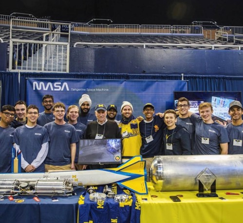

For the past two years I have been working at MASA as an aerodynamic and software engineer. Besides the technical work, we organize outreach events to share our experiences and motivate more students to joing careers in STEM.

Before starting my studies at the University of Michigan, I was able to meet with the first Brazilian astronaut and current Minister of Science, Technology and Innovation, Marcos Pontes, to discuss about research development on the Amazon Region and hear about his experiences in the International Space Station.

 Picture with Astronaut Alumni Al Worden from Apollo 15 during the Aerospace Day, October 2019         |  Meeting with Marcos Pontes, the first Brazilian Astronaut and current Minister of Science, Technology and Innovation
:--------------------------:|:-------------------------:
  |  
