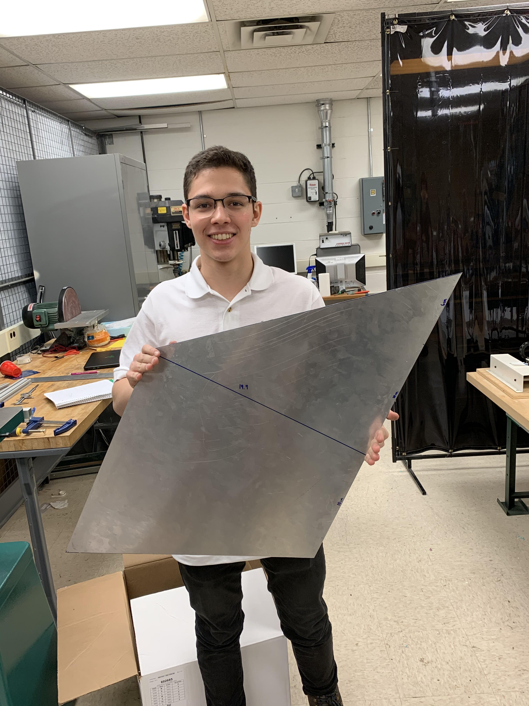
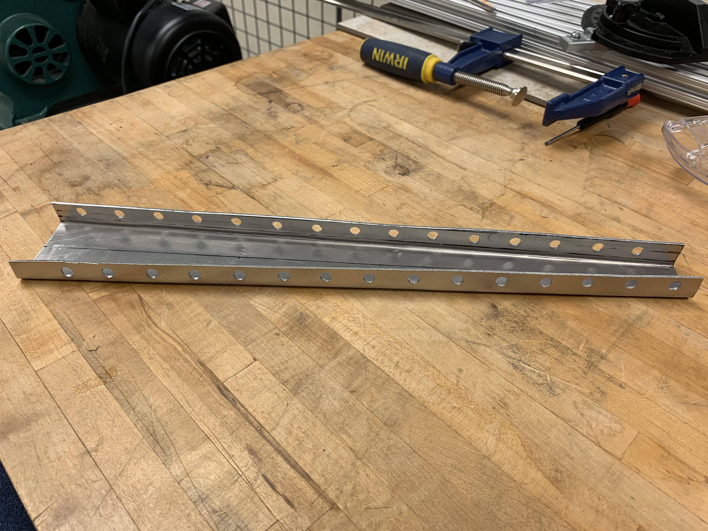
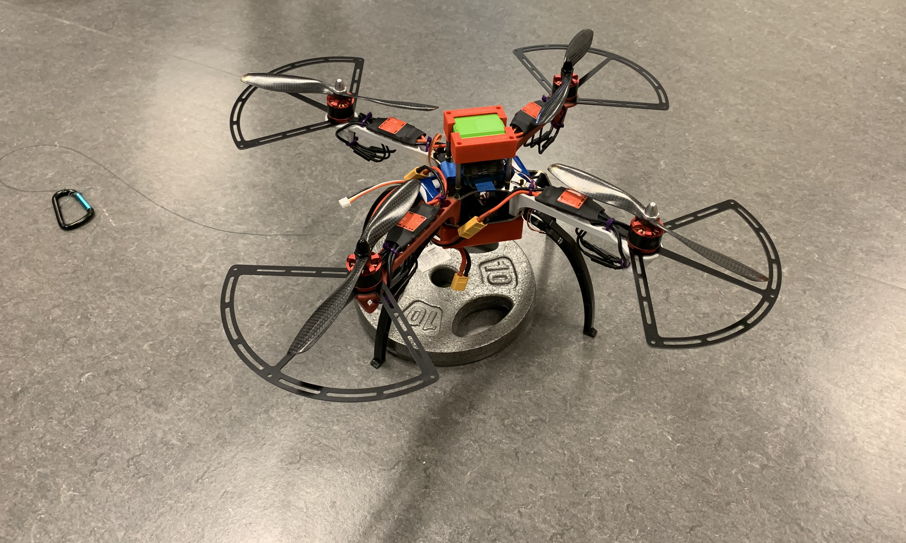
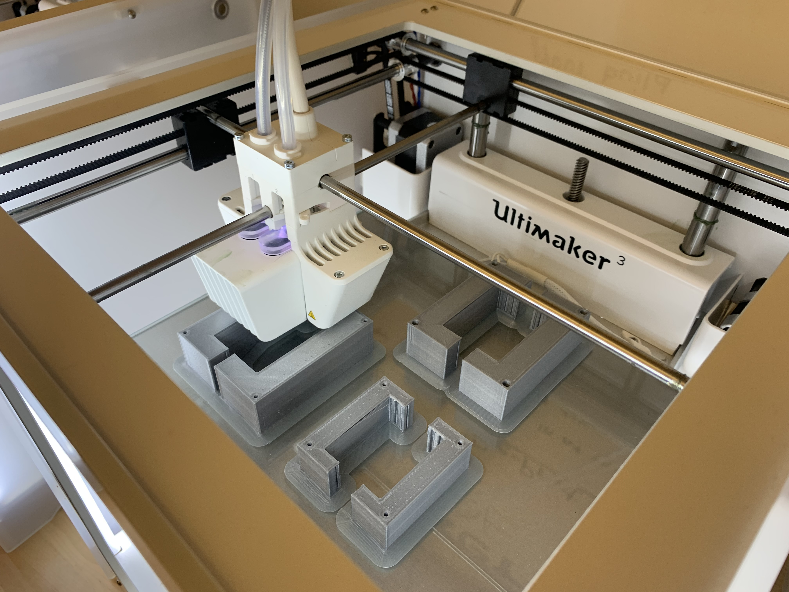
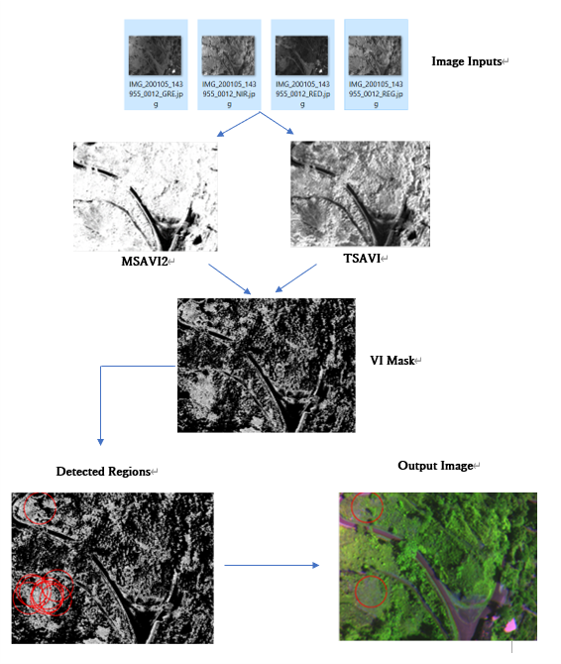

Below are some projects I have worked on at the University of Michigan. My academics interests include:
- Formal Verification
- Computational Fluid Dynamics
- Theory of Differential Equations


## Rocket Fins

As aerodynamic and software engineer at the [Michigan Aeronautical Science Association](https://masa.engin.umich.edu/), I am working on designing and testing the rocket fins for Tangerine Space Machine. Being creative is a great part of this project, since I am constantly facing ambiguous problems with an unscontrained path to solutions. Designing the rocket fins helped me to be persistant, as I had to do more research when the simulations failed and, to learn about systems thinking, specially on how this part fits in the entire project. 

Rocket fins are aerodynamic structures intended to provide stability during flight and assure that the rocket goes straight up. During the design process, several factors must be taken into account:

- Aerodynamic effects of fin shape
- Stiffness of strcture to prevent flutter
- Structural material to sustain temperatures and stress during flight
- Structrural mass

I have worked with Computational Fluid Dynamics (CFD) to simulate stress at hypersonic conditions and Structural simulations to identify the deformation in the Fins due to aerodynamic stresses. A complex project was merging both Fluid and Structural simulations in a Two-Way Fluid Structure Interface to investigate in-flight oscillations to optimize design against the "flutter condition", unstable oscillations that result in structural failure. 


Fin Skin Prototype            |  Fin Struts
:-------------------------:|:-------------------------:
  |  

<div align="center">
  2-Way FSI Simulation 
</div>

<div align="center">
</div>
<div align="center">
<iframe src="https://drive.google.com/file/d/1DyipDRDq58apX-IXsTwsVPmWk8TWjV9F/preview?start=1" width="320" height="240" frameborder="0" allow="accelerometer; autoplay; encrypted-media; gyroscope; picture-in-picture" allowfullscreen ></iframe>
</div>

## Formal Verification and Programming Language Design

Recently, I have been working with formal verification of hybrid systems in the Verified Aerospace Systems Laboratory at the University of Michigan. Currently adding verification capability to the synchronous language [Zelus](https://zelus.di.ens.fr/). 

I modified the Zelus compiler by inlcuding an additional step that implement typing rules for refinement types. The resulting language, called MARVLus, supports refinement type annotation for primitive variables, functions, tuples and streams. The code below is an example of a simple program with refinement type annotation that was succesfully verified by the MARVLus compiler.

```ocaml
let pi = 3.14159
let w = 2. *. pi
let y :float{y >= pi} = 4.0
```

This project helped me to improve communication and teamwork skills, specially when coordinating with the team to organize reports and divide the workload.

## F-330 Drone Modification

As a team project at the Center for Socially Engaged design, I built a F-330 drone and modified it by attaching 3D printed multispectral sensor to test for flight stability. I developed leadership skills by organizing the project schedule, setting deadlines, defining goals and delegating tasks. I learned about additive manufacturing, machining processes, 3D modeling and social research.

Modified F-330 Prototype           |  3D Printing Sensor Case
:-------------------------:|:-------------------------:
  |  


## Remote Sensing

Undergraduate reserach experience at the Environmental Spatial Analysis laboratory. The research included analyzing satellite imagery from Puerto Rican farms to indentify Hurricane Maria's impact on the island economy. Check some of the work at my [GitHub repository](https://github.com/jlvargasme/prhurricane).

This project was part of the Undergraduate Research Opportunity Program ([UROP](https://lsa.umich.edu/urop)) and it received the Blue Ribbon Award in the UROP Academic Symposium, Winter 2020.

Algorithm to Detect Green Zones with Low Vegetation Density          |
:-------------------------:|
  |  


