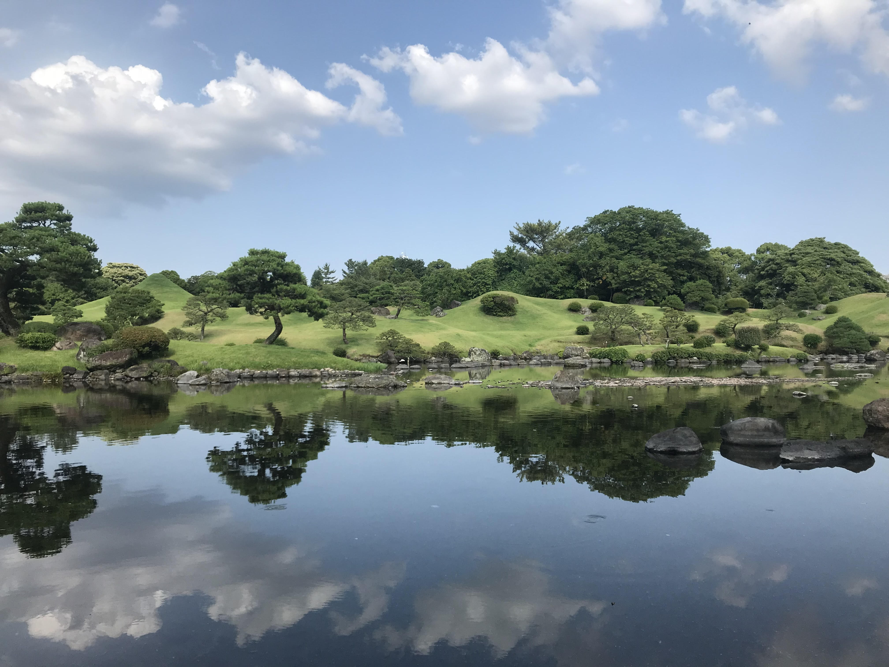
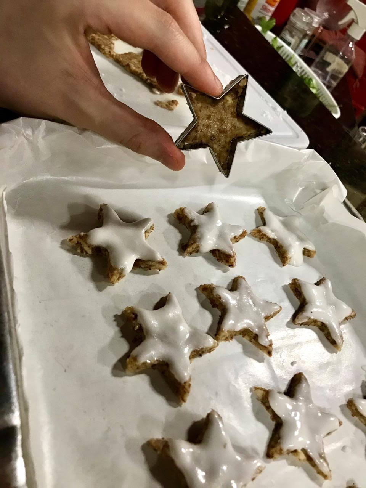

I am passionate about languages and cultures and learning about the different ways people express their tradition, either by diverse types of food, vocabulary or dance. This helps me analyze problems from different perspectives and be creative when proposing solutions. The experiences described below helped to increase my cultural awareness and make me eager to learn about other students I work with.

##### Japanese

   
  

  
 
  I made a homestay twice in Fukuoka. The first time, 2017, I travelled from center to south Japan with my father's friend. The second time, it was a mix of study-abroad at the Wahaha Japanese School and homestay with the same family. At left you can see the Kanji (空 - Sora) for "Sky" that I made in a caligraphy class. 
  

  

  
  <figcaption align="center">A beautiful picuture of Suizenji Jojuen Park in Kumamoto.</figcaption>

##### German

  
  

  
 
Max Kade Residential Community at the University of Michigan. As part of the community I took German 310 and 312, where I learned about the culture of Berlin. I gave presentations about the "narrative past", "Start-ups in Berlin" and "Fun Fact about Angela Merkel". One of the remarkable activities, was hosting a Zimtsterne (cinnamon stars) cooking event just before Winter break.
  

  

##### Portuguese

Originally from Manaus-Brazil, Portuguese is my native language. 

#####  Spanish

High School Spanish Classes.

#####  Chinese

A recent project has been to learn Chinese. I am currently studying via Duolingo.

