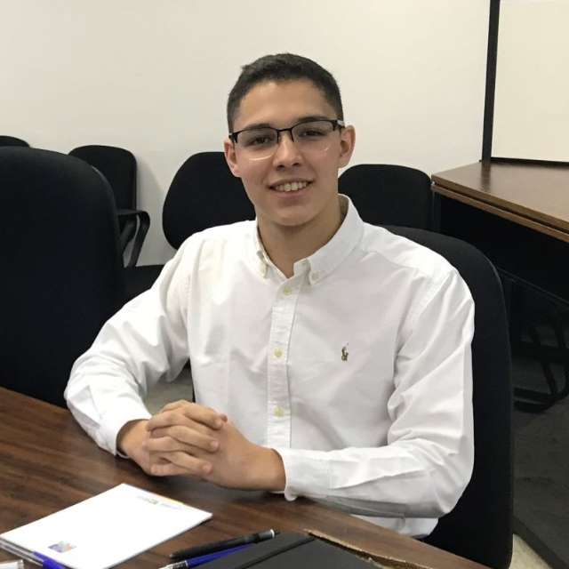

## Hey,

  
  

  
 I am a rising junior studying Aerospace and Computer Engineering at the University of Michigan. I am curious about how to use both majors to develop safer systems for aerospace vehicles and, create faster algorithms for analysis. Passionate about different languages, I have studied abroad in Japan and lived (virtually) in the Max Kade Haus, a german-speaking commmunity at the University of Michigan. As part of the College of Engineering Honors Program, I am excited about going deep in my interested and elaborating projects to help society advance.
  

  

